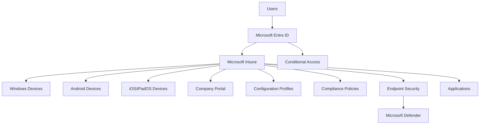

# High-Level Design

---

# Overview

This document describes the high-level design of the Microsoft Intune Enterprise Deployment solution.

The high-level design provides a conceptual view of the solution architecture, illustrating the primary components and their interactions without detailing implementation-specific configurations.

The purpose of this design is to establish a common understanding of the proposed solution before implementation begins.

---

# Design Objectives

The high-level design aims to:

- Provide a simplified view of the solution.
- Illustrate the interaction between core Microsoft cloud services.
- Identify major architectural components.
- Support solution planning and stakeholder communication.
- Establish the foundation for the detailed technical design.

---

# High-Level Solution Components

The Microsoft Intune solution consists of the following primary components.

| Component | Purpose |
|----------|---------|
| Users | Access corporate resources using managed devices |
| Microsoft Entra ID | Identity, authentication, and authorization |
| Microsoft Intune | Endpoint management platform |
| Microsoft Defender | Endpoint protection |
| Corporate Devices | Managed Windows devices |
| Mobile Devices | Managed Android and iOS devices |
| Company Portal | Device enrollment and application access |

---

# High-Level Architecture

---

# Solution Overview

The solution uses Microsoft Entra ID as the central identity provider.

Microsoft Intune acts as the primary endpoint management platform, delivering configuration profiles, compliance policies, endpoint security configurations, and applications to managed devices.

Conditional Access integrates with Microsoft Entra ID to ensure that only compliant and trusted devices can access organizational resources.

Microsoft Defender enhances endpoint protection through integrated security controls.

---

# Core Services

The solution provides the following enterprise services.

- Identity Management
- Device Enrollment
- Endpoint Management
- Configuration Management
- Compliance Management
- Endpoint Security
- Application Deployment
- Reporting and Monitoring

---

# Supported Platforms

The solution supports the following platforms.

| Platform | Management |
|----------|------------|
| Windows 10 | Microsoft Intune |
| Windows 11 | Microsoft Intune |
| Android | Microsoft Intune |
| iOS / iPadOS | Microsoft Intune |
| macOS | Future Consideration |

---

# Design Benefits

The proposed design provides:

- Centralized management
- Standardized configuration
- Improved endpoint security
- Cloud-native administration
- Scalable architecture
- Simplified operations
- Secure access to corporate resources

---

# Design Outcome

The high-level design establishes the overall structure of the Microsoft Intune solution.

The detailed implementation, configuration decisions, and operational procedures will be defined within the Low-Level Design and subsequent implementation documents.

---