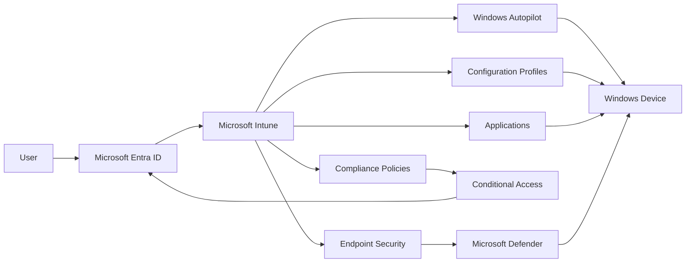

# Low-Level Design

---

# Overview

This document defines the detailed technical design for the Microsoft Intune Enterprise Deployment solution.

The low-level design expands upon the High-Level Design by describing the individual solution components, their relationships, configuration responsibilities, and implementation considerations.

This document serves as the technical blueprint for implementation.

---

# Design Objectives

The objectives of the low-level design are to:

- Define the technical components of the solution.
- Describe component interactions.
- Establish implementation boundaries.
- Support configuration planning.
- Provide technical guidance for implementation.

---

# Technical Components

| Component | Function |
|-----------|----------|
| Microsoft Entra ID | Identity provider and authentication platform |
| Microsoft Intune | Endpoint management service |
| Windows Autopilot | Device provisioning and enrollment |
| Microsoft Defender | Endpoint protection |
| Company Portal | Device enrollment and application access |
| Configuration Profiles | Device configuration management |
| Compliance Policies | Device compliance evaluation |
| Endpoint Security | Security policy enforcement |
| Applications | Software deployment and lifecycle management |
| Conditional Access | Access control based on identity and compliance |

---

# Component Relationships

---

# Identity Services

Microsoft Entra ID provides:

- User authentication
- Device identities
- Group membership
- Administrative roles
- Conditional Access integration

---

# Endpoint Management

Microsoft Intune is responsible for:

- Device enrollment
- Device configuration
- Compliance evaluation
- Application deployment
- Endpoint security
- Device actions
- Reporting

---

# Device Provisioning

Windows Autopilot provides:

- Zero-touch deployment
- Device registration
- User-driven deployment
- Enrollment Status Page (ESP)
- Device provisioning automation

---

# Configuration Management

Configuration Profiles will provide:

- Windows settings
- Administrative Templates
- Device restrictions
- Wi-Fi configuration
- VPN configuration
- Microsoft Edge configuration

---

# Compliance Management

Compliance Policies will evaluate:

- Operating system version
- BitLocker status
- Secure Boot
- Password compliance
- Microsoft Defender status

---

# Endpoint Security

Endpoint Security will manage:

- Microsoft Defender Antivirus
- Firewall
- BitLocker
- Attack Surface Reduction
- Disk Encryption
- Device Control

---

# Application Management

Microsoft Intune will manage:

- Microsoft 365 Apps
- Microsoft Store applications
- Win32 applications
- Company Portal applications
- Application updates

---

# Conditional Access

Conditional Access will integrate with Microsoft Entra ID to:

- Require compliant devices
- Require Multi-Factor Authentication
- Restrict access based on device state
- Protect cloud applications

---

# Reporting

Microsoft Intune reporting will provide:

- Device inventory
- Compliance reports
- Deployment status
- Endpoint Analytics
- Security reporting

---

# Design Considerations

The detailed design has been developed with the following considerations:

- Scalability
- Security
- Operational simplicity
- Automation
- Standardization
- Future growth
- Microsoft best practices

---

# Low-Level Design Outcome

The low-level design provides the technical blueprint required to implement Microsoft Intune in a secure, standardized, and maintainable manner.

This design forms the basis for the implementation activities that begin in later project sprints.

---