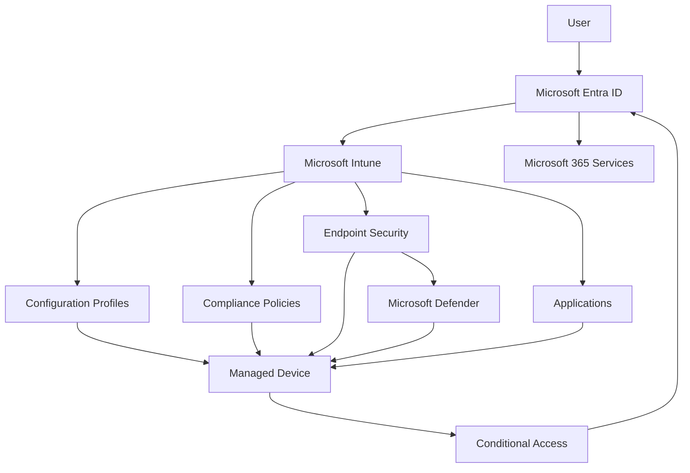

# Logical Architecture

---

# Overview

This document describes the logical architecture of the Microsoft Intune Enterprise Deployment solution.

The logical architecture illustrates how users, identities, devices, management services, security controls, and cloud resources interact to provide a secure and centrally managed endpoint management platform.

Unlike the physical architecture, the logical architecture focuses on relationships between services rather than infrastructure components.

---

# Architecture Objectives

The logical architecture has been designed to:

- Illustrate service interactions.
- Define management boundaries.
- Describe policy flow.
- Define authentication flow.
- Support future scalability.
- Improve operational understanding.

---

# Logical Architecture Diagram

---

# Identity Layer

Microsoft Entra ID provides:

- User authentication
- Device identities
- Group membership
- Administrative roles
- Conditional Access integration

This layer forms the trust boundary for all cloud services.

---

# Management Layer

Microsoft Intune provides centralized endpoint administration through:

- Device enrollment
- Configuration Profiles
- Compliance Policies
- Endpoint Security
- Application deployment
- Reporting

---

# Security Layer

The security layer includes:

- Microsoft Defender
- Endpoint Security
- BitLocker
- Firewall
- Compliance Policies
- Conditional Access

These controls protect both organizational resources and managed devices.

---

# Endpoint Layer

The endpoint layer consists of:

- Windows 10 devices
- Windows 11 devices
- Android devices
- iOS / iPadOS devices

Each managed device receives configurations from Microsoft Intune according to organizational policies.

---

# Productivity Layer

Organizational users securely access Microsoft 365 services using compliant and trusted devices.

Conditional Access policies evaluate both user identity and device compliance before access is granted.

---

# Management Flow

The logical management flow is:

1. User authenticates with Microsoft Entra ID.
2. Device enrolls into Microsoft Intune.
3. Configuration profiles are assigned.
4. Compliance policies are evaluated.
5. Endpoint Security policies are applied.
6. Applications are deployed.
7. Conditional Access evaluates device compliance.
8. Access to Microsoft 365 resources is granted.

---

# Design Benefits

The logical architecture provides:

- Centralized management
- Identity-driven access
- Standardized policy deployment
- Automated compliance evaluation
- Secure resource access
- Simplified administration
- Scalable endpoint management

---

# Architecture Outcome

The logical architecture establishes the operational relationships between Microsoft cloud services, managed devices, and organizational users.

This design supports a secure, scalable, and policy-driven endpoint management environment aligned with Microsoft best practices.

---