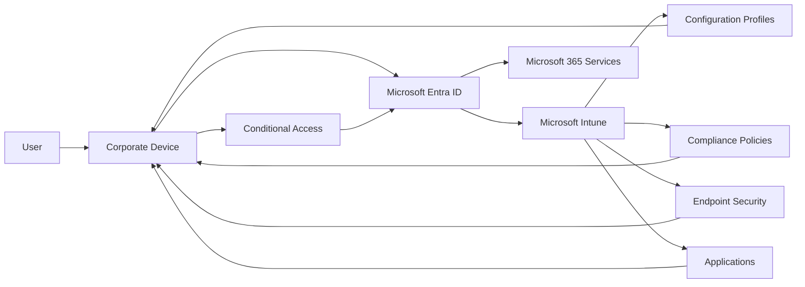

# Identity and Device Flow

---

# Overview

This document describes the end-to-end identity, authentication, device enrollment, compliance evaluation, and resource access flow for the Microsoft Intune Enterprise Deployment solution.

The objective is to illustrate how identities, devices, Microsoft Intune, Microsoft Entra ID, and Microsoft 365 services interact throughout the device lifecycle.

---

# Objectives

This document aims to:

- Describe the authentication process.
- Explain device enrollment.
- Illustrate policy deployment.
- Explain compliance evaluation.
- Demonstrate Conditional Access.
- Define the end-user experience.

---

# Identity and Device Flow

---

# Authentication Flow

The authentication process follows these steps:

1. The user signs in using their Microsoft Entra ID credentials.
2. Microsoft Entra ID authenticates the user.
3. Device identity is verified.
4. Microsoft Intune confirms device enrollment.
5. Compliance status is evaluated.
6. Conditional Access policies are applied.
7. Access to Microsoft 365 services is granted if policy requirements are satisfied.

---

# Device Enrollment Flow

The device enrollment process includes:

1. Device registration.
2. Microsoft Entra ID Join or registration.
3. Microsoft Intune enrollment.
4. Device synchronization.
5. Policy assignment.
6. Application deployment.
7. Compliance evaluation.
8. Operational readiness.

---

# Policy Deployment Flow

Following enrollment, Microsoft Intune delivers:

- Configuration Profiles
- Compliance Policies
- Endpoint Security Policies
- Applications
- Device Actions

Policy deployment occurs automatically according to group assignments and policy targeting.

---

# Compliance Evaluation

Compliance is continuously evaluated based on organizational requirements.

Evaluation includes:

- Operating system version
- Device encryption
- Password compliance
- Secure Boot
- Microsoft Defender status
- Device health

Devices failing compliance evaluation may have restricted access to organizational resources.

---

# Conditional Access Flow

Conditional Access evaluates:

- User identity
- Device identity
- Device compliance
- Authentication requirements
- Organizational access policies

Only compliant and trusted devices are permitted to access protected Microsoft 365 resources.

---

# End-User Experience

The intended user experience is:

1. User receives a corporate device.
2. User signs in with organizational credentials.
3. Device automatically enrolls into Microsoft Intune.
4. Configuration Profiles are applied.
5. Required applications are installed.
6. Compliance is evaluated.
7. User gains secure access to organizational resources.

The process should require minimal manual intervention.

---

# Design Benefits

The proposed identity and device flow provides:

- Secure authentication.
- Automated enrollment.
- Standardized configuration.
- Continuous compliance monitoring.
- Secure resource access.
- Simplified device provisioning.
- Improved operational efficiency.

---

# Architecture Outcome

The identity and device flow establishes the operational sequence through which users and devices interact with Microsoft Entra ID, Microsoft Intune, and Microsoft 365 services.

This design supports secure, automated, and scalable endpoint management aligned with Microsoft best practices.

---