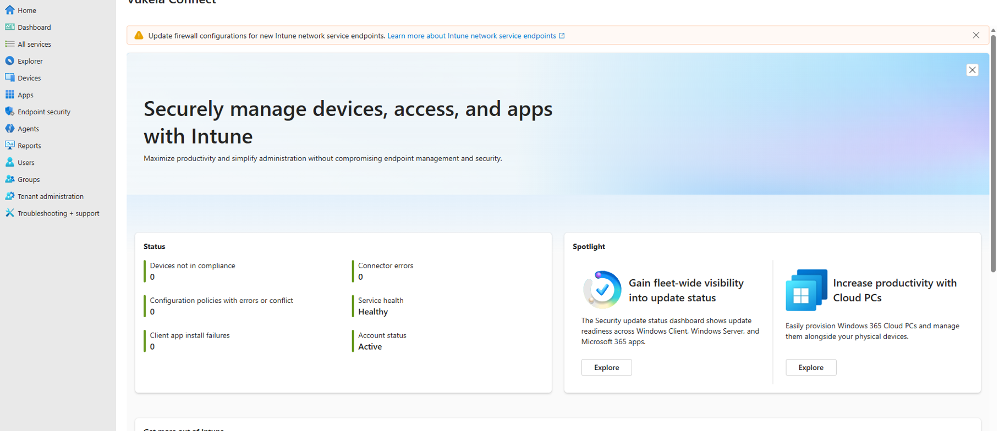

# Windows Device Enrollment

---

# Overview

This document defines the Windows device enrollment process for the Microsoft Intune Enterprise Deployment project.

Device enrollment is the process through which Windows devices are registered with Microsoft Entra ID and enrolled into Microsoft Intune, enabling centralized management, policy deployment, compliance evaluation, and application delivery.

This document will be updated throughout the implementation as enrollment activities are completed and validated.

---

# Objectives

The objectives of this activity are to:

- Understand the Windows enrollment process.
- Verify enrollment prerequisites.
- Configure enrollment settings where required.
- Successfully enroll the first pilot Windows device.
- Validate successful enrollment.

---

# Scope

This activity includes:

- Windows device enrollment
- Microsoft Entra ID integration
- Microsoft Intune enrollment
- Device synchronization
- Enrollment validation

This activity does not include:

- Configuration Profiles
- Compliance Policies
- Endpoint Security
- Application Deployment
- Windows Autopilot

These activities will be completed during later sprints.

---

# Prerequisites

Before beginning enrollment, the following must be available:

- Microsoft Intune Administrator access
- Microsoft Entra ID Administrator access (where required)
- Microsoft Intune license assigned
- Pilot user account
- Windows test device
- Internet connectivity

---

# Expected Outcome

At the completion of this activity:

- The pilot Windows device is successfully enrolled.
- The device appears in Microsoft Intune.
- The device reports to Microsoft Entra ID.
- Device synchronization is successful.
- The device is ready for management.

---

# Implementation Plan

The implementation will follow these high-level steps:

1. Review enrollment settings.
2. Verify tenant configuration.
3. Confirm licensing.
4. Prepare the Windows device.
5. Enroll the device.
6. Verify synchronization.
7. Validate enrollment.

Implementation details will be completed after configuration.

---

# Validation Plan

Enrollment will be considered successful when:

- The device appears in Microsoft Intune.
- The device reports a healthy enrollment status.
- The assigned user is correct.
- Device synchronization completes successfully.
- No enrollment errors are present.

---

# Implementation Evidence

## Result

Microsoft Intune tenant accessibility was successfully verified.

The tenant is active, Microsoft Intune is configured as the MDM authority, and no service health or connector issues were identified.

No managed devices are currently enrolled, confirming a clean Proof of Concept environment.

## Validation

- Successfully accessed the Microsoft Intune Admin Center.
- Verified tenant status.
- Confirmed Microsoft Intune MDM authority.
- Confirmed service health is operational.
- Verified no connector errors.
- Confirmed zero enrolled devices.

## Screenshots

- Microsoft Intune Dashboard 

The Microsoft Intune dashboard was reviewed to verify tenant accessibility and service health.

## Notes

The tenant is in a healthy state and ready for the initial device enrollment activities.
---

# References

- Microsoft Learn – Enroll Windows devices in Microsoft Intune
- Microsoft Learn – Microsoft Entra joined devices
- Microsoft Intune Admin Center
- Microsoft Entra Admin Center

---

# Status

**Current Status:** Ready for Implementation

---