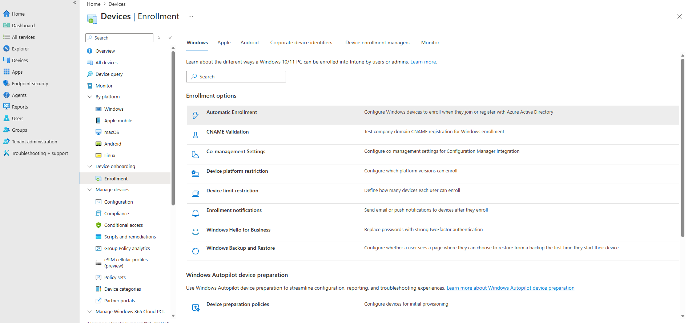
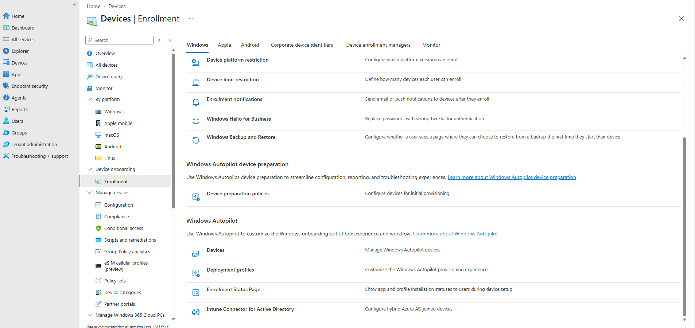

# Windows Enrollment Settings

---

# Overview

This document reviews the Microsoft Intune enrollment configuration for Windows devices.

The purpose of this activity is to verify that the tenant is correctly configured to support Windows device enrollment before enrolling the first pilot device.

No configuration changes will be made unless they are required to support the Proof of Concept.

---

# Objectives

The objectives of this activity are to:

- Review Windows enrollment settings.
- Verify automatic enrollment configuration.
- Review enrollment restrictions.
- Verify device platform support.
- Confirm enrollment readiness.

---

# Scope

This activity includes:

- Windows enrollment settings
- Automatic enrollment
- Enrollment restrictions
- Enrollment status page
- Device platform readiness

This activity excludes:

- Device enrollment
- Configuration Profiles
- Compliance Policies
- Application deployment

---

# Expected Outcome

At the completion of this activity:

- Windows enrollment settings have been reviewed.
- Enrollment prerequisites have been validated.
- Any required configuration changes have been identified.
- The tenant is confirmed ready for pilot device enrollment.

---

# Implementation Plan

The following areas will be reviewed:

1. Windows enrollment
2. Automatic enrollment
3. Enrollment restrictions
4. Enrollment Status Page (ESP)
5. Windows Autopilot (review only)

---

# Validation Plan

This activity will be considered successful when:

- Windows enrollment settings have been reviewed.
- Enrollment configuration is understood.
- No blocking issues are identified.

---

# Implementation Evidence

## Result

Windows enrollment settings were successfully reviewed.

The tenant provides access to all required Windows enrollment configuration areas, including Automatic Enrollment, Enrollment Restrictions, Enrollment Status Page (ESP), and Windows Autopilot.

No blocking configuration issues were identified during the initial review.

## Validation

The following enrollment components were successfully reviewed:

- Automatic Enrollment
- Device Platform Restrictions
- Device Limit Restrictions
- Enrollment Notifications
- Windows Hello for Business
- Windows Backup and Restore
- Windows Autopilot
- Enrollment Status Page (ESP)
- Intune Connector for Active Directory

## Screenshots

- Windows Enrollment

The Windows Enrollment page was reviewed to verify that the tenant provides all required enrollment features for the Proof of Concept.

- Windows Autopilot and Enrollment Status Page

The Windows Autopilot and Enrollment Status Page configuration options were confirmed to be available for future implementation activities.

## Notes

The Windows enrollment configuration is in its default state and is suitable for beginning the Proof of Concept.

Configuration changes will only be made where required during subsequent implementation activities.

---

# References

- Microsoft Learn – Windows enrollment
- Microsoft Learn – Automatic enrollment
- Microsoft Learn – Enrollment restrictions
- Microsoft Learn – Enrollment Status Page (ESP)
- Microsoft Intune Admin Center

---

# Status

Current Status: ✅ Completed

---