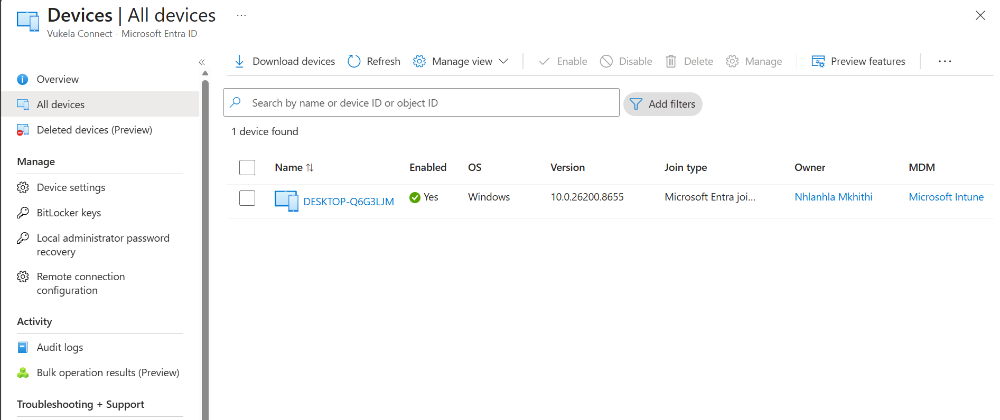
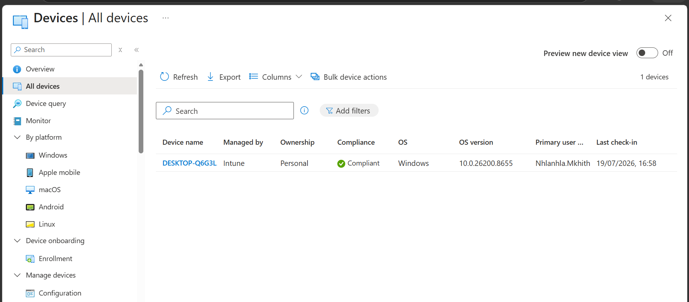

# First Windows Device Enrollment

---

# Overview

This document records the enrollment of the first Windows device into Microsoft Intune as part of the Microsoft Intune Enterprise Deployment Proof of Concept (PoC).

This activity represents the first practical implementation within the project and validates that Windows devices can be successfully enrolled and managed using Microsoft Intune.

The document will be updated as implementation and validation activities are completed.

---

# Objectives

The objectives of this activity are to:

- Successfully enroll the first Windows device.
- Verify Microsoft Entra ID registration.
- Confirm Microsoft Intune enrollment.
- Validate device synchronization.
- Prepare the device for future policy deployment.

---

# Scope

This activity includes:

- Windows device enrollment
- Microsoft Entra ID registration
- Microsoft Intune enrollment
- Device synchronization
- Initial management validation

This activity excludes:

- Configuration Profiles
- Compliance Policies
- Endpoint Security
- Application Deployment
- Windows Autopilot configuration

These activities will be completed during later sprints.

---

# Prerequisites

Before beginning enrollment, the following prerequisites must be satisfied:

- Microsoft Intune tenant is operational.
- Administrative access has been verified.
- Microsoft Intune license is assigned.
- Pilot user account is available.
- Test Windows device is available.
- Internet connectivity is available.

---

# Expected Outcome

Successful completion of this activity will result in:

- Windows device enrolled into Microsoft Intune.
- Device registered with Microsoft Entra ID.
- Device visible within the Microsoft Intune Admin Center.
- Assigned user displayed correctly.
- Device synchronization completed successfully.
- Device ready for policy assignment.

---

# Implementation Plan

The implementation will follow these steps:

1. Confirm the pilot user account.
2. Prepare the Windows device.
3. Sign in using the pilot user account.
4. Enroll the device into Microsoft Intune.
5. Verify successful enrollment.
6. Confirm device synchronization.
7. Validate the device within Microsoft Intune.

Implementation evidence will be completed after enrollment.

---

# Validation Plan

Enrollment will be considered successful when:

- The device appears within Microsoft Intune.
- Microsoft Entra ID registration is successful.
- The assigned user is correct.
- The device synchronizes successfully.
- No enrollment errors are reported.

---

# Implementation Evidence

## Result

The first Windows 11 Pro device was successfully joined to Microsoft Entra ID and enrolled into Microsoft Intune.

The implementation confirmed that the enrollment process completed successfully and that the device is now managed by the Microsoft Intune Proof of Concept tenant, providing a foundation for future policy deployment, application management, and compliance validation.

## Validation

The following validation checks were completed successfully:

- ✅ Windows 11 Pro device prepared for enrollment.
- ✅ Device successfully joined to Microsoft Entra ID.
- ✅ Device successfully enrolled into Microsoft Intune.
- ✅ Device appears in Microsoft Entra ID.
- ✅ Device appears in Microsoft Intune.
- ✅ Device is ready for centralized management and future policy deployment.

The successful enrollment validates that the Microsoft Intune Proof of Concept environment is functioning as expected and is ready for the next implementation phase.

## Screenshots

### Microsoft Entra ID Device Registration

The device appears successfully within Microsoft Entra ID, confirming that the Microsoft Entra join process completed successfully.

---

### Microsoft Intune Device Enrollment

The enrolled device is visible within Microsoft Intune, confirming successful enrollment and management readiness.

---

## Notes

- A clean Windows 11 Pro device was used for the Proof of Concept deployment.
- Microsoft Entra ID Join was completed before Microsoft Intune enrollment.
- Successful enrollment was verified by confirming the device appears in both Microsoft Entra ID and Microsoft Intune.
- This implementation establishes the baseline for subsequent configuration profiles, compliance policies, endpoint security policies, and application deployments within the Proof of Concept environment.
---

# References

- Microsoft Learn – Enroll Windows devices
- Microsoft Learn – Microsoft Entra joined devices
- Microsoft Intune Admin Center
- Microsoft Entra Admin Center

---

# Status

Current Status: ✅ Completed

---