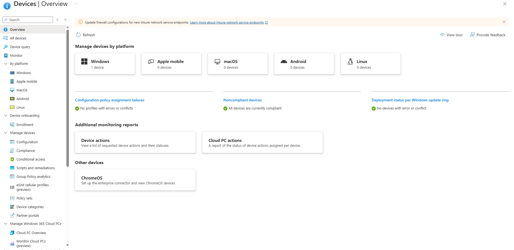
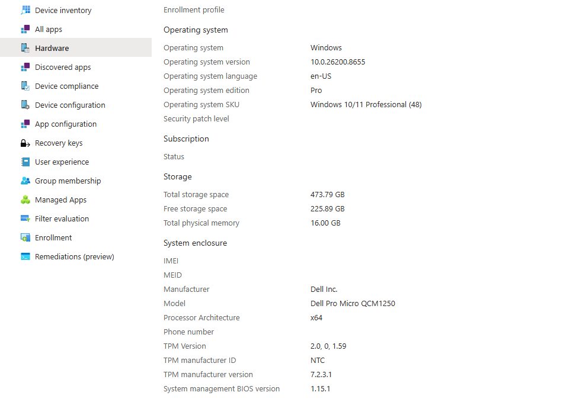

# Sprint 5 - 04 Enrollment Validation

## Overview

This phase validates the successful enrollment of the first Windows 11 Pro device into Microsoft Intune. The objective is to confirm that the device is actively managed, compliant, synchronized, and ready for centralized administration through the Microsoft Intune Proof of Concept environment.

---

## Objectives

- Validate successful Microsoft Intune enrollment.
- Verify the device management status.
- Confirm compliance status.
- Validate synchronization with Microsoft Intune.
- Verify device ownership and primary user assignment.
- Confirm readiness for policy deployment.

---

## Scope

This validation includes:

- Device management verification
- Compliance validation
- Synchronization status
- Device ownership
- Primary user verification
- Operating system validation
- Management readiness

---

## Prerequisites

Before beginning this validation, ensure the following requirements have been completed:

- Windows 11 Pro device enrolled into Microsoft Intune.
- Device successfully joined to Microsoft Entra ID.
- Device visible within the Microsoft Intune Admin Center.
- Internet connectivity available.

---

## Validation Activities

The following validation checks were performed after device enrollment:

- Verified the device appears in Microsoft Intune.
- Confirmed the device is managed by Microsoft Intune.
- Verified the compliance status.
- Confirmed successful synchronization.
- Verified the primary user assignment.
- Confirmed device ownership.
- Verified operating system information.
- Confirmed readiness for future policy deployment.

---

## Result

The enrolled Windows 11 Pro device successfully passed all validation checks.

The device is actively managed by Microsoft Intune, reports a compliant status, synchronizes successfully with the tenant, and is fully prepared for future configuration profile, compliance policy, application deployment, and endpoint security implementations.

---

## Validation

The following validation checks completed successfully:

- ✅ Device is visible within Microsoft Intune.
- ✅ Managed by Microsoft Intune.
- ✅ Compliance Status: Compliant.
- ✅ Primary user assigned successfully.
- ✅ Device ownership identified as Personal.
- ✅ Windows operating system detected successfully.
- ✅ Device synchronization completed successfully.
- ✅ Last device check-in recorded successfully.

The successful validation confirms that the endpoint is fully operational and ready for centralized management through Microsoft Intune.

---

## Screenshots

### Windows Devices

Validation confirming the enrolled Windows device appears within Microsoft Intune and reports a compliant status.

---

### Device Overview

Validation of the enrolled device overview within Microsoft Intune.

---

### Hardware Information

Validation of the Windows device hardware and operating system information.

---

## Notes

- The enrolled device is successfully managed by Microsoft Intune.
- Compliance evaluation completed successfully.
- Device synchronization with Microsoft Intune is operational.
- The endpoint is ready for the deployment of Configuration Profiles, Compliance Policies, Endpoint Security policies, PowerShell scripts, and Windows applications.
- This validation confirms that the Microsoft Intune Proof of Concept environment is functioning as expected.

# Status

Current Status:✅Completed

---